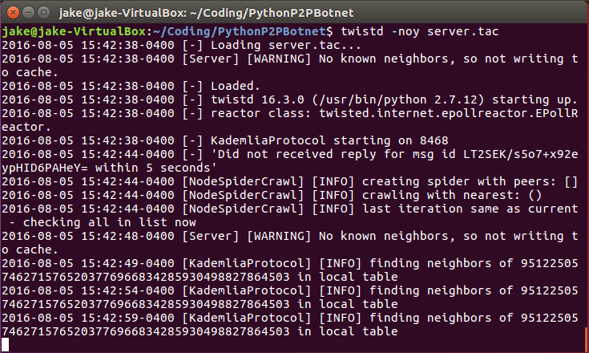

# P2P Botnet

This project is a proof of concept P2P botnet written in Python. It was a final project for CS460 at the University of Illinois at Urbana-Champaign for the Spring 2016 semester. 

The main idea behind the project was to design a botnet architecture that was not only resistant to targeted takedown attempts, but also protects the identity of the botnet owner. This was accomplished by using a Kademlia DHT. Upon joining the network, bots query a specific hash in the DHT, post their unique ID, and then wait for an acknowledgement from a commander. A commander will constantly check the login location for new bots, and send out ACKs when new bots join the network. Commands are sent via specific query locations that are unique to each bot. Since every bot has a unique command location, its easy to send commands to individual clients while still being easy to send global commands to all clients. The commander never has direct contact with a bot, all communication is performed through DHT queries. This protects the commander from being compromised by a rogue client. This is just a proof of concept, but more features such as digitally signed commands could easily be added for additional security. 

##Dependencies

This P2P botnet requires Python 2.7 and the following Python libraries:
* [Kademlia] - a Python implementation of the [Kademlia distributed hash table]
* [Twisted] - an event-driven asynchronous network engine written in Python.
* [Python Xlib](https://github.com/python-xlib/python-xlib) - Python X library which is used by the keylogging module
* [Mechanize](http://wwwsearch.sourceforge.net/mechanize/) - a programmatic web browsing library used by the clickfraud module

On an Ubuntu machine all of the requirements can be installed by running the following commands:
```
$ sudo apt-get install python-pip python-twisted-core python-xlib
$ pip install kademlia
$ pip install mechanize
```
Windows and MacOS have not been tested.

In addition to the requirements to run the project, the botnet also needs three different machines that can communicate over a network. This can be done in virtual machines or physical machines, but each machine must be able to communicate with the other machines and must have the above dependencies installed.

##Usage

The botnet consists of three primary components:
* botnet.py - client node that communicates with other nodes and waits for commands from a commander
* commander.py - command module to send commands to enslaved nodes in the botnet
* server.tac - a kademlia server for clients to bootstrap into the network

To use the botnet, perform the following commands on 3 separate machines.
* Step 1: Start Bootstrap Server
```
twistd -noy server.tac
```
* Step 2: Start Command Module
```
python commander.py [bootstrap ip][bootstrap port][commander port]
```
*Note: default bootstrap port is 8468, this can be changed in server.tac*

* Step 3: Start Botnet Client
```
python botnet.py [bootstrap ip][bootstrap port][botnet port]
```
At this point you should have 3 different windows open. From the commander window, you have the option to type in commands for the various modules that are included.


*Server window:*



In addition to the above components, there are several example modules that can be executed by the botnet such as a ddos attack module, a keylogger module, and a bitcoin mining module. Additional modules could easily be added. 


##Possible Improvements

There are a number of ways that this botnet could be improved. This was my first time learning the Twisted framework, so some of the code structure could be improved, primarily the botnet.py code. In addition I would add more security features including digitally signed commands, and more unpredictable check in hash locations. This project was a quick and dirty proof of concept that was quickly hacked together. Another improvement I would have made would be to improve the module section for botnet commands. Right now the botnet is sending cleartext commands in the DHT but these should really be encrypted, signed, and possibly serializable objects. The commands were thrown in after the basic networking architecture was implemented, and the example modules were developed separately so that we had to hack together a quick and dirty solution to get them to play together. Not all the modules have been extensively tested and could use improvement.

##Authors
* [James Howard](https://github.com/jhoward321) - *Botnet implementation and keylogging module* - jhoward321@gmail.com
* [Dhyaanesh Mullagur](https://github.com/dionesh) - *Bitcoin mining module* - mdhyanu@gmail.com
* [James Zhen](https://github.com/jzhen4) - *DDOS, upload, download modules* - jzhen4@illinois.edu

##License

This project is licensed under the MIT License - see the [LICENSE](LICENSE) file for details

[Kademlia]:https://github.com/bmuller/kademlia
[Twisted]:https://twistedmatrix.com/trac/
[Kademlia distributed hash table]:https://pdos.csail.mit.edu/~petar/papers/maymounkov-kademlia-lncs.pdf
